Визуализация данных. HW1
================
Дмитрий Зубков
October 17, 2022

## Задание 1-2

``` r
df <-  read_csv("insurance_cost.csv")
```

    ## Rows: 1338 Columns: 7
    ## -- Column specification --------------------------------------------------------
    ## Delimiter: ","
    ## chr (3): sex, smoker, region
    ## dbl (4): age, bmi, children, charges
    ## 
    ## i Use `spec()` to retrieve the full column specification for this data.
    ## i Specify the column types or set `show_col_types = FALSE` to quiet this message.

``` r
skim(df)
```

|                                                  |      |
|:-------------------------------------------------|:-----|
| Name                                             | df   |
| Number of rows                                   | 1338 |
| Number of columns                                | 7    |
| \_\_\_\_\_\_\_\_\_\_\_\_\_\_\_\_\_\_\_\_\_\_\_   |      |
| Column type frequency:                           |      |
| character                                        | 3    |
| numeric                                          | 4    |
| \_\_\_\_\_\_\_\_\_\_\_\_\_\_\_\_\_\_\_\_\_\_\_\_ |      |
| Group variables                                  | None |

**Variable type: character**

| skim\_variable |  n\_missing|  complete\_rate|  min|  max|  empty|  n\_unique|  whitespace|
|:---------------|-----------:|---------------:|----:|----:|------:|----------:|-----------:|
| sex            |           0|               1|    4|    6|      0|          2|           0|
| smoker         |           0|               1|    2|    3|      0|          2|           0|
| region         |           0|               1|    9|    9|      0|          4|           0|

**Variable type: numeric**

| skim\_variable |  n\_missing|  complete\_rate|      mean|        sd|       p0|      p25|      p50|       p75|      p100| hist  |
|:---------------|-----------:|---------------:|---------:|---------:|--------:|--------:|--------:|---------:|---------:|:------|
| age            |           0|               1|     39.21|     14.05|    18.00|    27.00|    39.00|     51.00|     64.00| ▇▅▅▆▆ |
| bmi            |           0|               1|     30.66|      6.10|    15.96|    26.30|    30.40|     34.69|     53.13| ▂▇▇▂▁ |
| children       |           0|               1|      1.09|      1.21|     0.00|     0.00|     1.00|      2.00|      5.00| ▇▂▂▁▁ |
| charges        |           0|               1|  13270.42|  12110.01|  1121.87|  4740.29|  9382.03|  16639.91|  63770.43| ▇▂▁▁▁ |

## Задание 3-6

``` r
charges_mean <- round(mean(df$charges))
charges_median <- round(median(df$charges))


charges_density <-
  ggplot(df, aes(x = charges)) +
  geom_density() +
  geom_vline(xintercept = charges_mean, color = "red") +
  geom_vline(xintercept = charges_median, color = "blue") +
  annotate("text", color = "red",
           x = charges_mean+6000, 
           y = 6e-05, 
           label = paste0("Mean = ", charges_mean)) + 
  annotate("text", color = "blue",
           x = charges_median-6000, 
           y = 7e-05, 
           label = paste0("Median = ", charges_median)) + 
  xlab("Траты в год") +
  ylab("Плотность") +
  theme_minimal()

charges_density
```

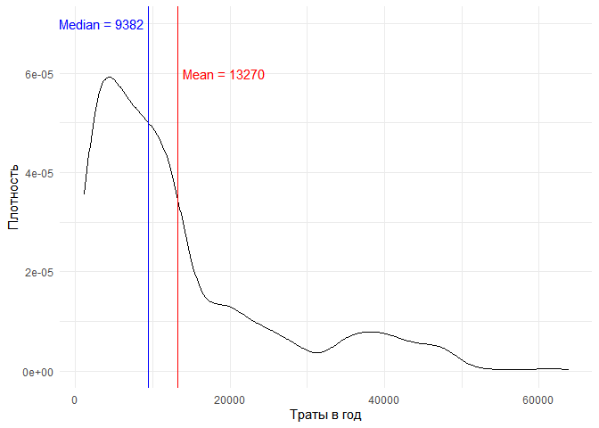

``` r
charges_sex <- 
  ggplot(df, aes(x = charges, y = sex)) +
  geom_boxplot() +
  xlab("Траты в год") +
  ylab("Пол") +
  theme_minimal()
charges_smoker <- 
  ggplot(df, aes(x = charges, y = smoker)) +
  geom_boxplot() +
  xlab("Траты в год") +
  ylab("Курение") +
  theme_minimal()
charges_region <-
  ggplot(df, aes(x = charges, y = region)) +
  geom_boxplot() +
  xlab("Траты в год") +
  ylab("Регион") +
  theme_minimal()

combine_plot <- ggarrange(charges_sex, charges_smoker, charges_region,
                          ncol = 3, nrow = 1)

combine_plot
```

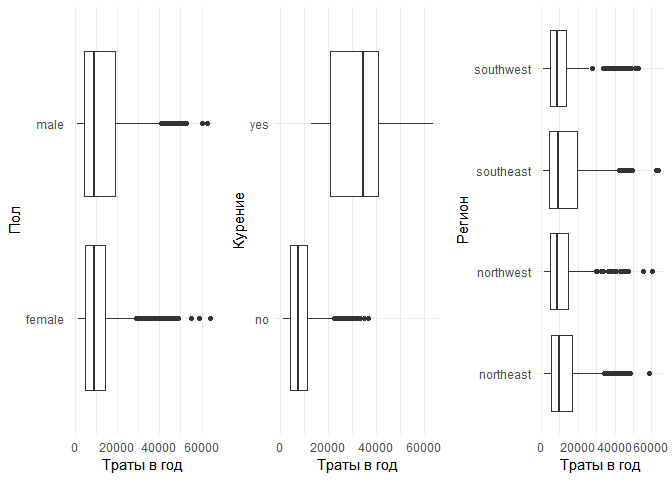

``` r
combine_plot <- 
  ggarrange(charges_density, combine_plot, nrow= 2, ncol = 1) %>% 
  annotate_figure(top = "Распределение трат в год в зависимости от факторов")

combine_plot
```

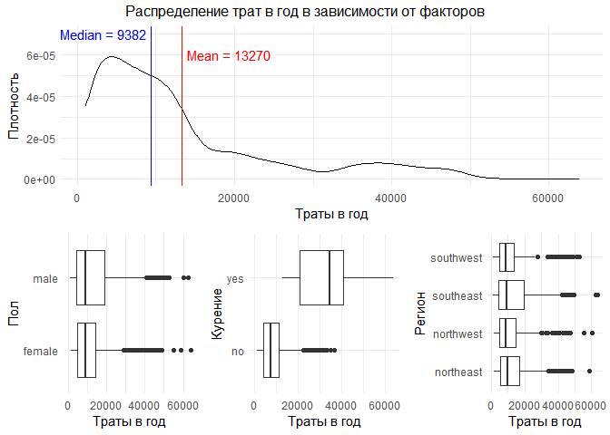

``` r
df.sum <- 
  df %>%
  group_by(region) %>%
  summarize(mean = round(mean(charges)), 
            median = round(median(charges)))

ggplot(df, aes(x = charges)) +
  facet_wrap(~region) +
  geom_density() +
  geom_vline(data = df.sum,
             aes(xintercept = mean), color = "red") +
  geom_vline(data = df.sum,
             aes(xintercept = median), color = "blue") +
  geom_text(data = df.sum, 
            aes(x = mean + 12000, label = paste0("Mean = ", mean)),
            color = "red",
            y = 6e-05) +
  geom_text(data = df.sum, 
            aes(x = median + 12000, label = paste0("Median = ", median)),
            color = "blue",
            y = 7e-05) +
  xlab("Траты в год") +
  ylab("Плотность") +
  ylim(c(0, 7e-05)) +
  theme_minimal()
```

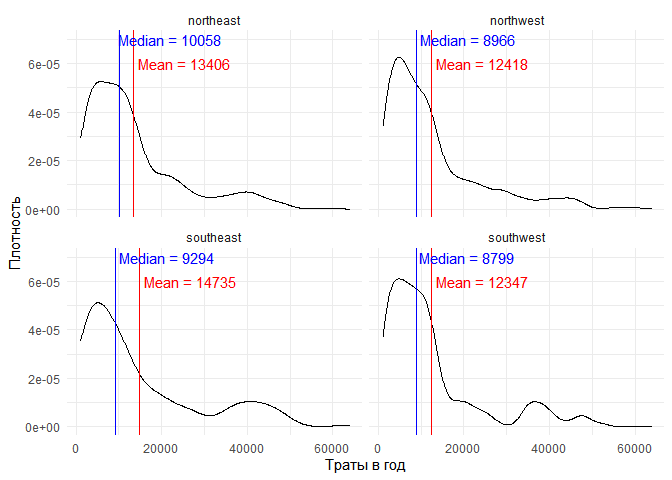

## Задание 7-10

``` r
ggplot(df, aes(x = age, y = charges)) +
  geom_point(alpha = 0.5) +
  geom_smooth() +
  xlab("Возраст, лет") +
  ylab("Траты в год") +
  theme_minimal()
```

    ## `geom_smooth()` using method = 'gam' and formula 'y ~ s(x, bs = "cs")'

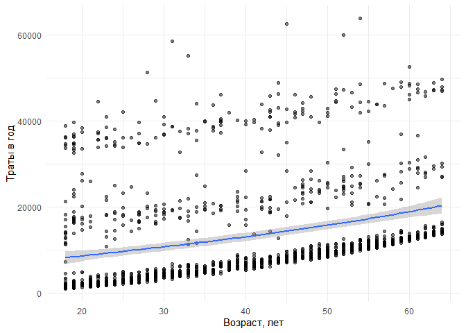

``` r
ggplot(df, aes(x = age, y = charges, color = smoker)) +
  geom_point(alpha = 0.5) +
  geom_smooth() +
  xlab("Возраст, лет") +
  ylab("Траты в год") +
  theme_minimal()
```

    ## `geom_smooth()` using method = 'gam' and formula 'y ~ s(x, bs = "cs")'

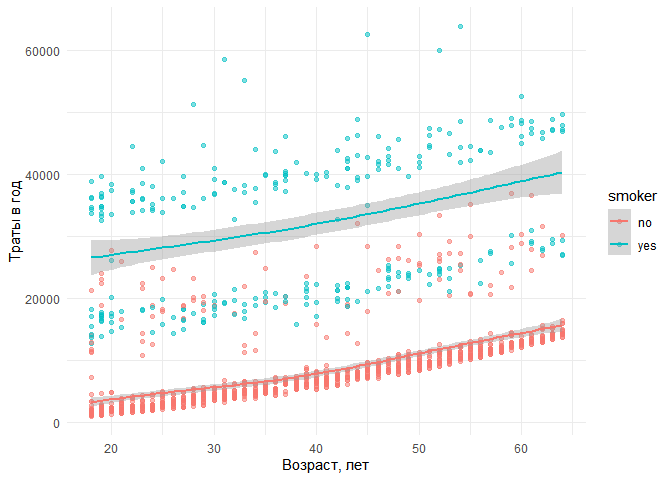

``` r
ggplot(df, aes(x = bmi, y = charges, color = smoker)) +
  geom_point(alpha = 0.5) +
  geom_smooth() +
  xlab("Индекс массы тела") +
  ylab("Траты в год") +
  theme_minimal()
```

    ## `geom_smooth()` using method = 'gam' and formula 'y ~ s(x, bs = "cs")'

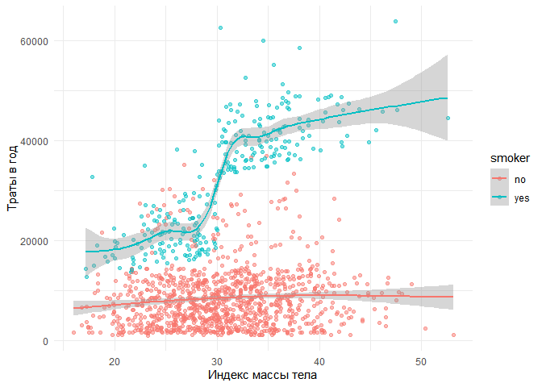

## Задание 11-13

### Форма распределения страховых застрат

Посмотрим еще раз на распределение страховых затрат.

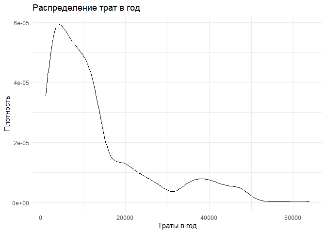

Видно, что распределение сильно смещено влево. Попробуем логарифмическую шкалу, может быть это выровняет распределение.

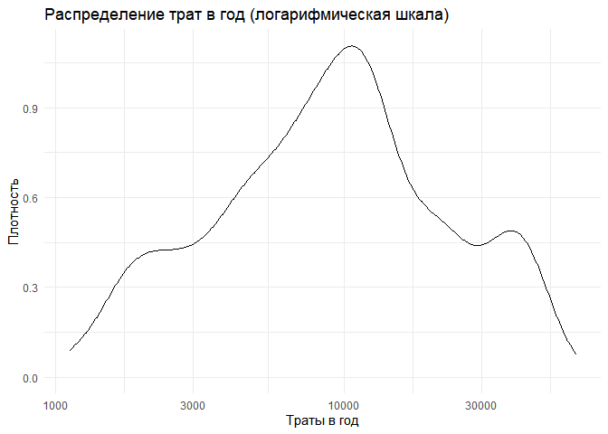

Видно, что распределение стало симметричнее и приблизилось к нормальному. Поэтому далее будем пользоваться логарифмической шкалой для страховых затрат.

### Влияние BMI и курения на страховые затраты

Взглянем еще раз на график зависимости трат от BMI в группах курящих и некурящих.

    ## `geom_smooth()` using method = 'gam' and formula 'y ~ s(x, bs = "cs")'


Видно, что выборка сильно разделяется по фактору курения и по BMI, причем значение **BMI = 30** служит своего рода водоразделом. Это же значение BMI - пограниченое для ожирения. Создадим новую факторную переменную obesity и посмотрим на распределение и боксплоты.

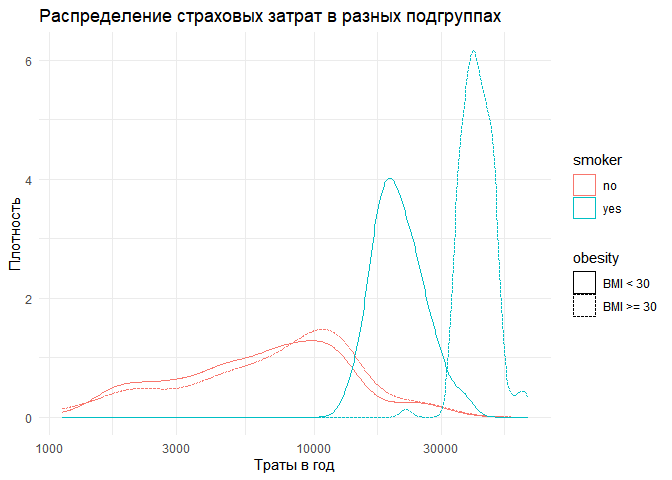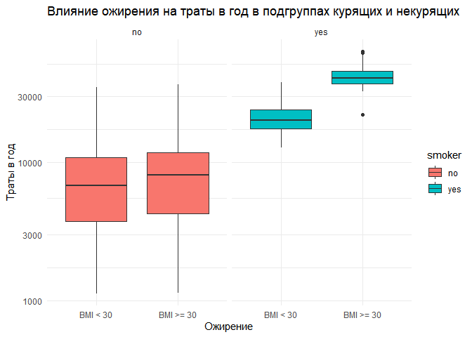

Проверим также линии тренда для зависимости страховых затрат от возраста в подгруппах курящих/некурящих и клиентов с ожирением/без ожирения. Два синонимичных графика:

    ## `geom_smooth()` using method = 'loess' and formula 'y ~ x'

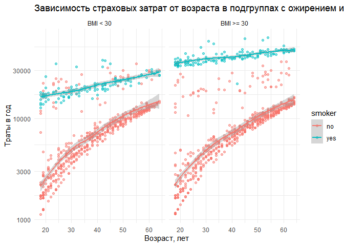

    ## `geom_smooth()` using formula 'y ~ x'

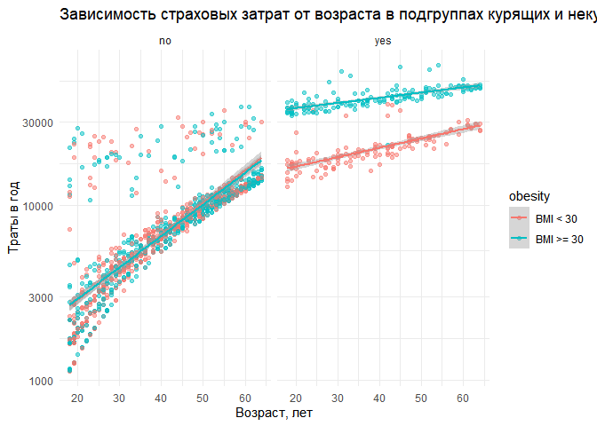

Выводы:

-   Курение повышает страховые затраты.
-   Ожирение не влияет на страховые затраты в подгруппе некурящих и ассоциировано с их повышением в группе курящих.
-   Судя по предыдущему графику, на котором выборка некурящих "расщеплена" вне зависимости от степени ожирения, возможно, есть еще какой-то фактор, который влияет на страховые затраты.

### Влияние числа детей на страховые затраты

Во всем предыдущем анализе мы не анализировали еще два фактора, которые есть в исходных данных -- число детей в семье.

Построим же боксплоты величины затрат для разного числа детей в подгруппе некурящих, чтобы исключить влияние фактора курения.

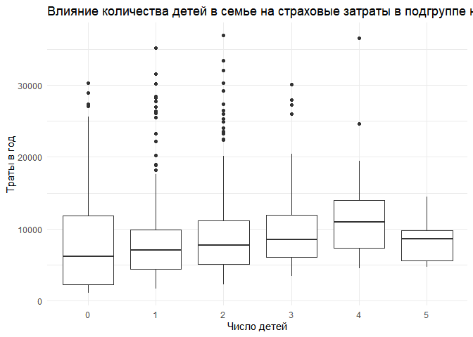

Есть тенденция к росту затрат при росте числа детей. Изучим зависимость трат от возраста и числа детей.

    ## `geom_smooth()` using formula 'y ~ x'

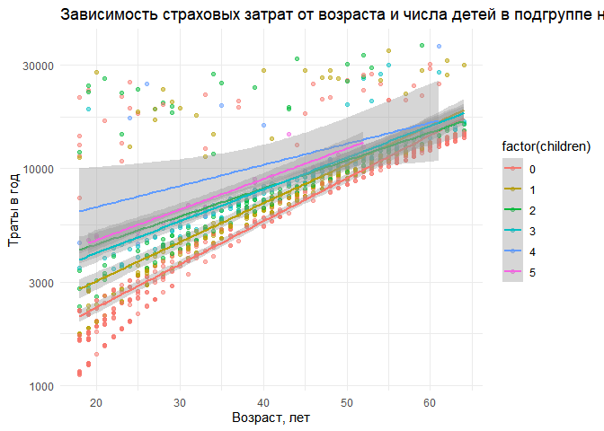

Выводы:

-   Есть тенденция к более высоким затратам при росте числа детей в семье от 0 до 4.
-   Эта разница более выражена в раннем возрасте.
-   Точнее сказать сложно, поскольку число клиентов с большим числом детей невелико.
-   Число детей в семье клиента не объясняет ранее обнаруженное "расщепление" выборки.

### Влияние пола на страховые затраты

Проведем те же манипуляции для изучения влияния пола в подгруппе некурящих.

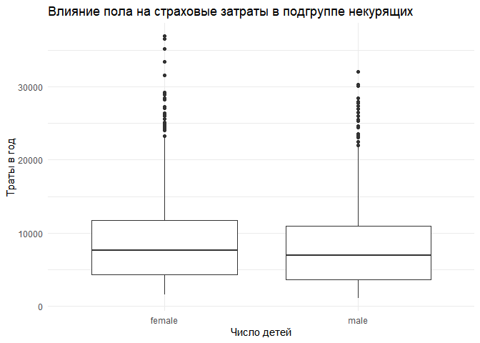

    ## `geom_smooth()` using formula 'y ~ x'

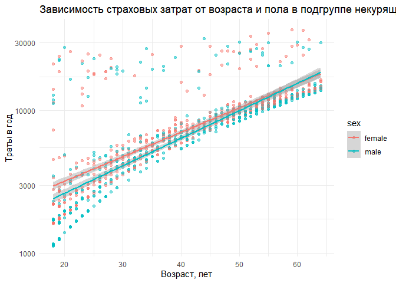

Выводы:

-   Есть тенденция к более высоким затратам на женщин, нежели на мужчин.
-   Эта разница более выражена в раннем возрасте.
-   Пол не объясняет ранее обнаруженное "расщепление" выборки.

### Влияние региона на страховые затраты

Проведем те же манипуляции для изучения влияния региона в подгруппе некурящих.

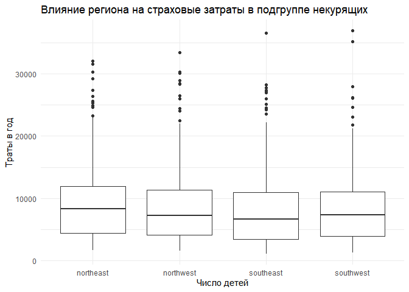

    ## `geom_smooth()` using formula 'y ~ x'

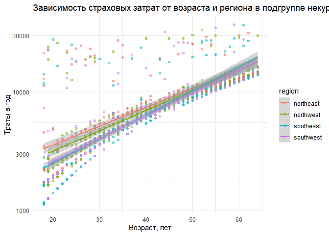

Выводы:

-   Есть тенденция к более высоким затратам в регионах northeast и northwest.
-   Эта разница более выражена в раннем возрасте.
-   Регион не объясняет ранее обнаруженное "расщепление" выборки.

## Задание 14

``` r
df <- mutate(df, age_group = case_when(age < 35 ~ "age: 18-34",
                                       age >= 35 & age < 50 ~ "age: 35-49",
                                       age >= 50 ~ "age: 50+"))

ggplot(df, aes(x = bmi, y = log(charges), color = age_group)) +
  facet_wrap(~age_group) +
  geom_point(fill = "#451874", color = "#451874", 
             shape = 21, alpha = 0.5) +
  geom_smooth(method = lm, formula = y ~ x) +
  ggtitle("Отношение индекса массы тела к логарифму трат по возрастным группам") +
  theme_minimal() +
  theme(legend.position = "bottom",
        plot.title = element_text(hjust = 0.5))
```

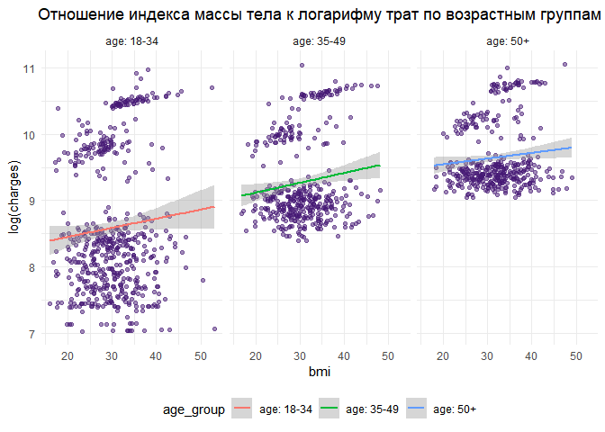
