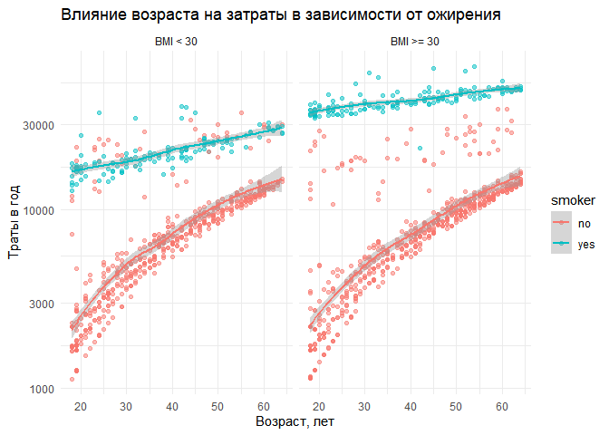
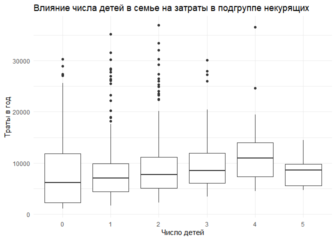

Задание 1-2
-----------

    df <-  read_csv("insurance_cost.csv")

    ## Rows: 1338 Columns: 7
    ## -- Column specification --------------------------------------------------------
    ## Delimiter: ","
    ## chr (3): sex, smoker, region
    ## dbl (4): age, bmi, children, charges
    ## 
    ## i Use `spec()` to retrieve the full column specification for this data.
    ## i Specify the column types or set `show_col_types = FALSE` to quiet this message.

    skim(df)

<table>
<caption>Data summary</caption>
<tbody>
<tr class="odd">
<td align="left">Name</td>
<td align="left">df</td>
</tr>
<tr class="even">
<td align="left">Number of rows</td>
<td align="left">1338</td>
</tr>
<tr class="odd">
<td align="left">Number of columns</td>
<td align="left">7</td>
</tr>
<tr class="even">
<td align="left">_______________________</td>
<td align="left"></td>
</tr>
<tr class="odd">
<td align="left">Column type frequency:</td>
<td align="left"></td>
</tr>
<tr class="even">
<td align="left">character</td>
<td align="left">3</td>
</tr>
<tr class="odd">
<td align="left">numeric</td>
<td align="left">4</td>
</tr>
<tr class="even">
<td align="left">________________________</td>
<td align="left"></td>
</tr>
<tr class="odd">
<td align="left">Group variables</td>
<td align="left">None</td>
</tr>
</tbody>
</table>

**Variable type: character**

<table>
<thead>
<tr class="header">
<th align="left">skim_variable</th>
<th align="right">n_missing</th>
<th align="right">complete_rate</th>
<th align="right">min</th>
<th align="right">max</th>
<th align="right">empty</th>
<th align="right">n_unique</th>
<th align="right">whitespace</th>
</tr>
</thead>
<tbody>
<tr class="odd">
<td align="left">sex</td>
<td align="right">0</td>
<td align="right">1</td>
<td align="right">4</td>
<td align="right">6</td>
<td align="right">0</td>
<td align="right">2</td>
<td align="right">0</td>
</tr>
<tr class="even">
<td align="left">smoker</td>
<td align="right">0</td>
<td align="right">1</td>
<td align="right">2</td>
<td align="right">3</td>
<td align="right">0</td>
<td align="right">2</td>
<td align="right">0</td>
</tr>
<tr class="odd">
<td align="left">region</td>
<td align="right">0</td>
<td align="right">1</td>
<td align="right">9</td>
<td align="right">9</td>
<td align="right">0</td>
<td align="right">4</td>
<td align="right">0</td>
</tr>
</tbody>
</table>

**Variable type: numeric**

<table>
<thead>
<tr class="header">
<th align="left">skim_variable</th>
<th align="right">n_missing</th>
<th align="right">complete_rate</th>
<th align="right">mean</th>
<th align="right">sd</th>
<th align="right">p0</th>
<th align="right">p25</th>
<th align="right">p50</th>
<th align="right">p75</th>
<th align="right">p100</th>
<th align="left">hist</th>
</tr>
</thead>
<tbody>
<tr class="odd">
<td align="left">age</td>
<td align="right">0</td>
<td align="right">1</td>
<td align="right">39.21</td>
<td align="right">14.05</td>
<td align="right">18.00</td>
<td align="right">27.00</td>
<td align="right">39.00</td>
<td align="right">51.00</td>
<td align="right">64.00</td>
<td align="left">▇▅▅▆▆</td>
</tr>
<tr class="even">
<td align="left">bmi</td>
<td align="right">0</td>
<td align="right">1</td>
<td align="right">30.66</td>
<td align="right">6.10</td>
<td align="right">15.96</td>
<td align="right">26.30</td>
<td align="right">30.40</td>
<td align="right">34.69</td>
<td align="right">53.13</td>
<td align="left">▂▇▇▂▁</td>
</tr>
<tr class="odd">
<td align="left">children</td>
<td align="right">0</td>
<td align="right">1</td>
<td align="right">1.09</td>
<td align="right">1.21</td>
<td align="right">0.00</td>
<td align="right">0.00</td>
<td align="right">1.00</td>
<td align="right">2.00</td>
<td align="right">5.00</td>
<td align="left">▇▂▂▁▁</td>
</tr>
<tr class="even">
<td align="left">charges</td>
<td align="right">0</td>
<td align="right">1</td>
<td align="right">13270.42</td>
<td align="right">12110.01</td>
<td align="right">1121.87</td>
<td align="right">4740.29</td>
<td align="right">9382.03</td>
<td align="right">16639.91</td>
<td align="right">63770.43</td>
<td align="left">▇▂▁▁▁</td>
</tr>
</tbody>
</table>

Задание 3-6
-----------

    charges_mean <- round(mean(df$charges))
    charges_median <- round(median(df$charges))

    charges_density <-
      ggplot(df, aes(x = charges)) +
      geom_density() +
      geom_vline(xintercept = charges_mean, color = "red") +
      geom_vline(xintercept = charges_median, color = "blue") +
      annotate("text", color = "red",
               x = charges_mean+6000, 
               y = 6e-05, 
               label = paste0("Mean = ", charges_mean)) + 
      annotate("text", color = "blue",
               x = charges_median-6000, 
               y = 7e-05, 
               label = paste0("Median = ", charges_median)) + 
      xlab("Траты в год") +
      ylab("Плотность") +
      theme_minimal()

    charges_density

    charges_sex <- 
      ggplot(df, aes(x = charges, y = sex)) +
      geom_boxplot() +
      xlab("Траты в год") +
      ylab("Пол") +
      theme_minimal()
    charges_smoker <- 
      ggplot(df, aes(x = charges, y = smoker)) +
      geom_boxplot() +
      xlab("Траты в год") +
      ylab("Курение") +
      theme_minimal()
    charges_region <-
      ggplot(df, aes(x = charges, y = region)) +
      geom_boxplot() +
      xlab("Траты в год") +
      ylab("Регион") +
      theme_minimal()

    combine_plot <- ggarrange(charges_sex, charges_smoker, charges_region,
                              ncol = 3, nrow = 1)

    combine_plot

    combine_plot <- 
      ggarrange(charges_density, combine_plot, nrow= 2, ncol = 1) %>% 
      annotate_figure(top = "Распределение трат в год в зависимости от факторов")

    combine_plot

    df.sum <- 
      df %>%
      group_by(region) %>%
      summarize(mean = round(mean(charges)), 
                median = round(median(charges)))

    ggplot(df, aes(x = charges)) +
      facet_wrap(~region) +
      geom_density() +
      geom_vline(data = df.sum,
                 aes(xintercept = mean), color = "red") +
      geom_vline(data = df.sum,
                 aes(xintercept = median), color = "blue") +
      geom_text(data = df.sum, 
                aes(x = mean + 12000, label = paste0("Mean = ", mean)),
                color = "red",
                y = 6e-05) +
      geom_text(data = df.sum, 
                aes(x = median + 12000, label = paste0("Median = ", median)),
                color = "blue",
                y = 7e-05) +
      xlab("Траты в год") +
      ylab("Плотность") +
      ylim(c(0, 7e-05)) +
      theme_minimal()

Задание 7-10
------------

    ggplot(df, aes(x = age, y = charges)) +
      geom_point(alpha = 0.5) +
      geom_smooth() +
      xlab("Возраст, лет") +
      ylab("Траты в год") +
      theme_minimal()

    ## `geom_smooth()` using method = 'gam' and formula 'y ~ s(x, bs = "cs")'

    ggplot(df, aes(x = age, y = charges, color = smoker)) +
      geom_point(alpha = 0.5) +
      geom_smooth() +
      xlab("Возраст, лет") +
      ylab("Траты в год") +
      theme_minimal()

    ## `geom_smooth()` using method = 'gam' and formula 'y ~ s(x, bs = "cs")'

    ggplot(df, aes(x = bmi, y = charges, color = smoker)) +
      geom_point(alpha = 0.5) +
      geom_smooth() +
      xlab("Индекс массы тела") +
      ylab("Траты в год") +
      theme_minimal()

    ## `geom_smooth()` using method = 'gam' and formula 'y ~ s(x, bs = "cs")'

Задание 11-13
-------------

### Форма распределения страховых застрат

Посмотрим еще раз на распределение страховых затрат.

Видно, что распределение сильно смещено влево. Попробуем логарифмическую
шкалу, может быть это выровняет распределение.

Видно, что распределение стало симметричнее и приблизилось к
нормальному. Поэтому далее будем пользоваться логарифмической шкалой для
страховых затрат.

### Влияние BMI и курения на страховые затраты

Взглянем еще раз на график зависимости трат от BMI в группах курящих и
некурящих.

    ## `geom_smooth()` using method = 'gam' and formula 'y ~ s(x, bs = "cs")'

Видно, что выборка сильно разделяется по фактору курения и по BMI,
причем значение **BMI = 30** служит своего рода водоразделом. Это же
значение BMI - пограниченое для ожирения. Создадим новую факторную
переменную obesity и посмотрим на распределение и боксплоты.

Проверим также линии тренда для зависимости страховых затрат от возраста
в подгруппах курящих/некурящих и клиентов с ожирением/без ожирения. Два
синонимичных графика:

    ## `geom_smooth()` using method = 'loess' and formula 'y ~ x'

    ## `geom_smooth()` using formula 'y ~ x'

Выводы:

-   Курение повышает страховые затраты.
-   Ожирение не влияет на страховые затраты в подгруппе некурящих и
    ассоциировано с их повышением в группе курящих.
-   Судя по предыдущему графику, на котором выборка некурящих
    "расщеплена" вне зависимости от степени ожирения, возможно, есть еще
    какой-то фактор, который влияет на страховые затраты.

### Влияние числа детей на страховые затраты

Во всем предыдущем анализе мы не анализировали еще два фактора, которые
есть в исходных данных -- число детей в семье.

Построим же боксплоты величины затрат для разного числа детей в
подгруппе некурящих, чтобы исключить влияние фактора курения.

Есть тенденция к росту затрат при росте числа детей. Изучим зависимость
трат от возраста и числа детей.

    ## `geom_smooth()` using formula 'y ~ x'

Выводы:

-   Есть тенденция к более высоким затратам при росте числа детей в
    семье от 0 до 4.
-   Эта разница более выражена в раннем возрасте.
-   Точнее сказать сложно, поскольку число клиентов с большим числом
    детей невелико.
-   Число детей в семье клиента не объясняет ранее обнаруженное
    "расщепление" выборки.

### Влияние пола на страховые затраты

Проведем те же манипуляции для изучения влияния пола в подгруппе
некурящих.

    ## `geom_smooth()` using formula 'y ~ x'

Выводы:

-   Есть тенденция к более высоким затратам на женщин, нежели на мужчин.
-   Эта разница более выражена в раннем возрасте.
-   Пол не объясняет ранее обнаруженное "расщепление" выборки.

### Влияние региона на страховые затраты

Проведем те же манипуляции для изучения влияния региона в подгруппе
некурящих.

    ## `geom_smooth()` using formula 'y ~ x'

Выводы:

-   Есть тенденция к более высоким затратам в регионах northeast и
    northwest.
-   Эта разница более выражена в раннем возрасте.
-   Регион не объясняет ранее обнаруженное "расщепление" выборки.

Задание 14
----------

    df <- mutate(df, age_group = case_when(age < 35 ~ "age: 18-34",
                                           age >= 35 & age < 50 ~ "age: 35-49",
                                           age >= 50 ~ "age: 50+"))

    ggplot(df, aes(x = bmi, y = log(charges), color = age_group)) +
      facet_wrap(~age_group) +
      geom_point(fill = "#451874", color = "#451874", 
                 shape = 21, alpha = 0.5) +
      geom_smooth(method = lm, formula = y ~ x) +
      ggtitle("Отношение индекса массы тела к логарифму трат по возрастным группам") +
      theme_minimal() +
      theme(legend.position = "bottom",
            plot.title = element_text(hjust = 0.5))

