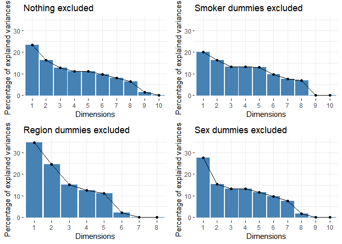
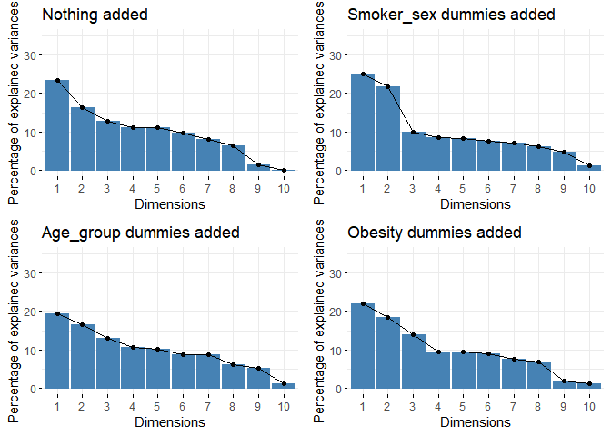

Задание 1
---------

    df <-  read_csv("insurance_cost.csv")
    skimr::skim(df)

<table>
<caption>Data summary</caption>
<tbody>
<tr class="odd">
<td align="left">Name</td>
<td align="left">df</td>
</tr>
<tr class="even">
<td align="left">Number of rows</td>
<td align="left">1338</td>
</tr>
<tr class="odd">
<td align="left">Number of columns</td>
<td align="left">7</td>
</tr>
<tr class="even">
<td align="left">_______________________</td>
<td align="left"></td>
</tr>
<tr class="odd">
<td align="left">Column type frequency:</td>
<td align="left"></td>
</tr>
<tr class="even">
<td align="left">character</td>
<td align="left">3</td>
</tr>
<tr class="odd">
<td align="left">numeric</td>
<td align="left">4</td>
</tr>
<tr class="even">
<td align="left">________________________</td>
<td align="left"></td>
</tr>
<tr class="odd">
<td align="left">Group variables</td>
<td align="left">None</td>
</tr>
</tbody>
</table>

**Variable type: character**

<table>
<thead>
<tr class="header">
<th align="left">skim_variable</th>
<th align="right">n_missing</th>
<th align="right">complete_rate</th>
<th align="right">min</th>
<th align="right">max</th>
<th align="right">empty</th>
<th align="right">n_unique</th>
<th align="right">whitespace</th>
</tr>
</thead>
<tbody>
<tr class="odd">
<td align="left">sex</td>
<td align="right">0</td>
<td align="right">1</td>
<td align="right">4</td>
<td align="right">6</td>
<td align="right">0</td>
<td align="right">2</td>
<td align="right">0</td>
</tr>
<tr class="even">
<td align="left">smoker</td>
<td align="right">0</td>
<td align="right">1</td>
<td align="right">2</td>
<td align="right">3</td>
<td align="right">0</td>
<td align="right">2</td>
<td align="right">0</td>
</tr>
<tr class="odd">
<td align="left">region</td>
<td align="right">0</td>
<td align="right">1</td>
<td align="right">9</td>
<td align="right">9</td>
<td align="right">0</td>
<td align="right">4</td>
<td align="right">0</td>
</tr>
</tbody>
</table>

**Variable type: numeric**

<table>
<thead>
<tr class="header">
<th align="left">skim_variable</th>
<th align="right">n_missing</th>
<th align="right">complete_rate</th>
<th align="right">mean</th>
<th align="right">sd</th>
<th align="right">p0</th>
<th align="right">p25</th>
<th align="right">p50</th>
<th align="right">p75</th>
<th align="right">p100</th>
<th align="left">hist</th>
</tr>
</thead>
<tbody>
<tr class="odd">
<td align="left">age</td>
<td align="right">0</td>
<td align="right">1</td>
<td align="right">39.21</td>
<td align="right">14.05</td>
<td align="right">18.00</td>
<td align="right">27.00</td>
<td align="right">39.00</td>
<td align="right">51.00</td>
<td align="right">64.00</td>
<td align="left">▇▅▅▆▆</td>
</tr>
<tr class="even">
<td align="left">bmi</td>
<td align="right">0</td>
<td align="right">1</td>
<td align="right">30.66</td>
<td align="right">6.10</td>
<td align="right">15.96</td>
<td align="right">26.30</td>
<td align="right">30.40</td>
<td align="right">34.69</td>
<td align="right">53.13</td>
<td align="left">▂▇▇▂▁</td>
</tr>
<tr class="odd">
<td align="left">children</td>
<td align="right">0</td>
<td align="right">1</td>
<td align="right">1.09</td>
<td align="right">1.21</td>
<td align="right">0.00</td>
<td align="right">0.00</td>
<td align="right">1.00</td>
<td align="right">2.00</td>
<td align="right">5.00</td>
<td align="left">▇▂▂▁▁</td>
</tr>
<tr class="even">
<td align="left">charges</td>
<td align="right">0</td>
<td align="right">1</td>
<td align="right">13270.42</td>
<td align="right">12110.01</td>
<td align="right">1121.87</td>
<td align="right">4740.29</td>
<td align="right">9382.03</td>
<td align="right">16639.91</td>
<td align="right">63770.43</td>
<td align="left">▇▂▁▁▁</td>
</tr>
</tbody>
</table>

Задание 2-3
-----------

    plot_ly(data = df,
            x = ~ bmi,
            y = ~ charges,
            color = ~ smoker) %>% 
      layout(title = 'Отношение страховых застрат и индекса массы тела',
             yaxis = list(title = 'Страховые затраты'),
             xaxis = list(title = 'Индекс массы тела')) 

    plot <- 
      ggplot(df, aes(x = bmi, y = charges, color = smoker)) +
      geom_point(alpha = 0.5) +
      ggtitle('Отношение страховых застрат и индекса массы тела') +
      ylab('Страховые затраты') +
      xlab('Индекс массы тела')

    ggplotly(plot)

Задание 4
---------

    library(corrplot)

    df.corr <- 
      df %>% 
      select(where(is.numeric)) %>%
      cor(method = "spearman")

    corrplot(df.corr)

    corrplot(df.corr, method = 'color')

Задание 5
---------

    library(caret)
    dummy <- dummyVars(" ~ .", data = df, sep = "_")
    df.dummy <- as_tibble(predict(dummy, newdata = df))
    skimr::skim(df.dummy)

<table>
<caption>Data summary</caption>
<tbody>
<tr class="odd">
<td align="left">Name</td>
<td align="left">df.dummy</td>
</tr>
<tr class="even">
<td align="left">Number of rows</td>
<td align="left">1338</td>
</tr>
<tr class="odd">
<td align="left">Number of columns</td>
<td align="left">12</td>
</tr>
<tr class="even">
<td align="left">_______________________</td>
<td align="left"></td>
</tr>
<tr class="odd">
<td align="left">Column type frequency:</td>
<td align="left"></td>
</tr>
<tr class="even">
<td align="left">numeric</td>
<td align="left">12</td>
</tr>
<tr class="odd">
<td align="left">________________________</td>
<td align="left"></td>
</tr>
<tr class="even">
<td align="left">Group variables</td>
<td align="left">None</td>
</tr>
</tbody>
</table>

**Variable type: numeric**

<table>
<thead>
<tr class="header">
<th align="left">skim_variable</th>
<th align="right">n_missing</th>
<th align="right">complete_rate</th>
<th align="right">mean</th>
<th align="right">sd</th>
<th align="right">p0</th>
<th align="right">p25</th>
<th align="right">p50</th>
<th align="right">p75</th>
<th align="right">p100</th>
<th align="left">hist</th>
</tr>
</thead>
<tbody>
<tr class="odd">
<td align="left">age</td>
<td align="right">0</td>
<td align="right">1</td>
<td align="right">39.21</td>
<td align="right">14.05</td>
<td align="right">18.00</td>
<td align="right">27.00</td>
<td align="right">39.00</td>
<td align="right">51.00</td>
<td align="right">64.00</td>
<td align="left">▇▅▅▆▆</td>
</tr>
<tr class="even">
<td align="left">sexfemale</td>
<td align="right">0</td>
<td align="right">1</td>
<td align="right">0.49</td>
<td align="right">0.50</td>
<td align="right">0.00</td>
<td align="right">0.00</td>
<td align="right">0.00</td>
<td align="right">1.00</td>
<td align="right">1.00</td>
<td align="left">▇▁▁▁▇</td>
</tr>
<tr class="odd">
<td align="left">sexmale</td>
<td align="right">0</td>
<td align="right">1</td>
<td align="right">0.51</td>
<td align="right">0.50</td>
<td align="right">0.00</td>
<td align="right">0.00</td>
<td align="right">1.00</td>
<td align="right">1.00</td>
<td align="right">1.00</td>
<td align="left">▇▁▁▁▇</td>
</tr>
<tr class="even">
<td align="left">bmi</td>
<td align="right">0</td>
<td align="right">1</td>
<td align="right">30.66</td>
<td align="right">6.10</td>
<td align="right">15.96</td>
<td align="right">26.30</td>
<td align="right">30.40</td>
<td align="right">34.69</td>
<td align="right">53.13</td>
<td align="left">▂▇▇▂▁</td>
</tr>
<tr class="odd">
<td align="left">children</td>
<td align="right">0</td>
<td align="right">1</td>
<td align="right">1.09</td>
<td align="right">1.21</td>
<td align="right">0.00</td>
<td align="right">0.00</td>
<td align="right">1.00</td>
<td align="right">2.00</td>
<td align="right">5.00</td>
<td align="left">▇▂▂▁▁</td>
</tr>
<tr class="even">
<td align="left">smokerno</td>
<td align="right">0</td>
<td align="right">1</td>
<td align="right">0.80</td>
<td align="right">0.40</td>
<td align="right">0.00</td>
<td align="right">1.00</td>
<td align="right">1.00</td>
<td align="right">1.00</td>
<td align="right">1.00</td>
<td align="left">▂▁▁▁▇</td>
</tr>
<tr class="odd">
<td align="left">smokeryes</td>
<td align="right">0</td>
<td align="right">1</td>
<td align="right">0.20</td>
<td align="right">0.40</td>
<td align="right">0.00</td>
<td align="right">0.00</td>
<td align="right">0.00</td>
<td align="right">0.00</td>
<td align="right">1.00</td>
<td align="left">▇▁▁▁▂</td>
</tr>
<tr class="even">
<td align="left">regionnortheast</td>
<td align="right">0</td>
<td align="right">1</td>
<td align="right">0.24</td>
<td align="right">0.43</td>
<td align="right">0.00</td>
<td align="right">0.00</td>
<td align="right">0.00</td>
<td align="right">0.00</td>
<td align="right">1.00</td>
<td align="left">▇▁▁▁▂</td>
</tr>
<tr class="odd">
<td align="left">regionnorthwest</td>
<td align="right">0</td>
<td align="right">1</td>
<td align="right">0.24</td>
<td align="right">0.43</td>
<td align="right">0.00</td>
<td align="right">0.00</td>
<td align="right">0.00</td>
<td align="right">0.00</td>
<td align="right">1.00</td>
<td align="left">▇▁▁▁▂</td>
</tr>
<tr class="even">
<td align="left">regionsoutheast</td>
<td align="right">0</td>
<td align="right">1</td>
<td align="right">0.27</td>
<td align="right">0.45</td>
<td align="right">0.00</td>
<td align="right">0.00</td>
<td align="right">0.00</td>
<td align="right">1.00</td>
<td align="right">1.00</td>
<td align="left">▇▁▁▁▃</td>
</tr>
<tr class="odd">
<td align="left">regionsouthwest</td>
<td align="right">0</td>
<td align="right">1</td>
<td align="right">0.24</td>
<td align="right">0.43</td>
<td align="right">0.00</td>
<td align="right">0.00</td>
<td align="right">0.00</td>
<td align="right">0.00</td>
<td align="right">1.00</td>
<td align="left">▇▁▁▁▂</td>
</tr>
<tr class="even">
<td align="left">charges</td>
<td align="right">0</td>
<td align="right">1</td>
<td align="right">13270.42</td>
<td align="right">12110.01</td>
<td align="right">1121.87</td>
<td align="right">4740.29</td>
<td align="right">9382.03</td>
<td align="right">16639.91</td>
<td align="right">63770.43</td>
<td align="left">▇▂▁▁▁</td>
</tr>
</tbody>
</table>

Задание 6-8
-----------

    library(factoextra)

    df.hc <- 
      df.dummy %>%
      scale() %>%
      dist(method = "euclidean") %>%
      hclust(method = "ward.D2")

    fviz_dend(df.hc, show_labels = F)

Раскрасим кластеры, волюнтаристски выбрав отсечение на 5 кластерах.

    fviz_dend(df.hc, k = 5,
              show_labels = F,
              k_colors = "Set1",
              color_labels_by_k = TRUE,
              rect = TRUE)

Визуализируем PCA с идентифицированными выше кластерами.

    grp <- cutree(df.hc, k = 5)

    fviz_cluster(list(data = df.dummy, cluster = grp),
                 palette = "Set1",
                 ellipse.type = "convex",
                 show.clust.cent = FALSE,
                 labelsize = 0,
                 ggtheme = theme_minimal())

Попробуем перебор методов рассчета дистанции (все варианты параметра
`method` функции `dist()`) и методов кластеризации (рекомендованные
методы `complete` или `ward.D2` функции `hclust()`). В целом
кластеризация очень неустойчива в зависимости от метода, как и было
упомянуто в лекции. Вот самое симпатичное, что получилось:

    grp <- 
      df.dummy %>%
      scale() %>%
      dist(method = "canberra") %>%
      hclust(method = "complete") %>%
      cutree(k = 4)

    fviz_cluster(list(data = df.dummy, cluster = grp),
                 palette = "Set1",
                 ellipse.type = "convex",
                 show.clust.cent = FALSE,
                 labelsize = 0,
                 ggtheme = theme_minimal())

Построим heat map с кластеризацией по первому использованому нами
методу.

    library(pheatmap)

    pheatmap(scale(df.dummy))

Задание 9
---------

    library(FactoMineR)
    library(ggbiplot)

    df.pca <- prcomp(df.dummy, scale = T)
    fviz_eig(df.pca)

    fviz_pca_var(df.pca, col.var = "contrib")

    fviz_pca_var(df.pca, 
                 select.var = list(contrib = 4),
                 col.var = "contrib")

    fviz_contrib(df.pca, choice = "var", axes = 1)

    fviz_contrib(df.pca, choice = "var", axes = 2)

    fviz_contrib(df.pca, choice = "var", axes = 3)

    ggbiplot(df.pca, scale = 0, alpha = 0.1) 

    ggbiplot(df.pca, 
             scale = 0, 
             groups = as.factor(df$smoker),
             ellipse = T,
             alpha = 0.1) 

    ggbiplot(df.pca, 
             scale = 0, 
             groups = as.factor(df$sex),
             ellipse = T,
             alpha = 0.1) 

Выводы:

-   PC1 объясняет около 23% дисперсии. Наибольший вклад в PC1 вносит
    статус по курению и страховым затратам.
-   PC2 объясняет около 16% дисперсии и почти полностью состоит из
    вариации по полу.
-   PC3 объясняет около 13% дисперсии и наибольший вклад в нее вносят
    регион клиентов и BMI.

### Задание 10-11

Поиграемся с новыми категориальными переменными.

    df.2 <-
      df %>%
      mutate(age_group = case_when(age < 35 ~ "age: 18-34",
                                   age >= 50 ~ "age: 50+",
                                   age >= 35 & age < 50 ~ "age: 35-49")) %>%
      mutate(obesity = case_when(bmi < 30 ~ "BMI < 30",
                                 bmi >= 30 ~ "BMI >= 30")) %>%
      mutate(smoker_sex = paste0(sex, ", ", smoker, " smoker"))

    ggbiplot(df.pca, 
             scale=0, 
             groups = df.2$age_group,
             ellipse = F,
             alpha = 0.1) 

    ggbiplot(df.pca, 
             scale=0, 
             groups = df.2$obesity,
             ellipse = F,
             alpha = 0.1) 

    ggbiplot(df.pca, 
             scale=0, 
             groups = df.2$smoker_sex,
             ellipse = T,
             alpha = 0.1) 

### Задание 12

Попробуем сначала исключить некоторые из dummy-переменных. "Качество"
PCA будем оценивать по проценту объясненной дисперсии (scree plot).

    df.pca <- 
      df.dummy %>%
      prcomp(scale = T)

    p1 <- 
      fviz_eig(df.pca)+
      ggtitle("Nothing excluded") +
      ylim(0, 35)

    df.pca <- 
      df.dummy %>%
      select(-contains("smoker")) %>%
      prcomp(scale = T)

    p2 <- 
      fviz_eig(df.pca)+
      ggtitle("Smoker dummies excluded") +
      ylim(0, 35)

    df.pca <- 
      df.dummy %>%
      select(-contains("region")) %>%
      prcomp(scale = T)

    p3 <-
      fviz_eig(df.pca)+
      ggtitle("Region dummies excluded") +
      ylim(0, 35)

    df.pca <- 
      df.dummy %>%
      select(-contains("sex")) %>%
      prcomp(scale = T)

    p4 <- 
      fviz_eig(df.pca)+
      ggtitle("Sex dummies excluded") +
      ylim(0, 35)

    ggarrange(p1, p2, p3, p4, ncol = 2, nrow = 2)

Итого, больше всего повышает качество PCA удаление информации о
регионах.

Теперь создадим новые dummy-переменные для новых факторных переменных,
созданных в задании 10-11.

    dummy <- dummyVars(" ~ .", data = df.2, sep = "_")
    df.2.dummy <- as_tibble(predict(dummy, newdata = df.2))

    df.pca <- 
      df.dummy %>%
      prcomp(scale = T)

    p1 <- 
      fviz_eig(df.pca)+
      ggtitle("Nothing added") +
      ylim(0, 35)

    df.pca <- 
      df.2.dummy %>%
      select(-contains("age_group"), -contains("obesity")) %>%
      prcomp(scale = T)

    p2 <-
      fviz_eig(df.pca)+
      ggtitle("Smoker_sex dummies added") +
      ylim(0, 35)

    df.pca <- 
      df.2.dummy %>%
      select(-contains("smoker_sex"), -contains("obesity")) %>%
      prcomp(scale = T)

    p3 <-
      fviz_eig(df.pca)+
      ggtitle("Age_group dummies added")  +
      ylim(0, 35)

    df.pca <- 
      df.2.dummy %>%
      select(-contains("age_group"), -contains("smoker_sex")) %>%
      prcomp(scale = T)

    p4 <- 
      fviz_eig(df.pca)+
      ggtitle("Obesity dummies added") +
      ylim(0, 35)

    ggarrange(p1, p2, p3, p4, ncol = 2, nrow = 2)

Итого, больше всего из рассмотренных вариантов повышает качество PCA
добавление переменной smoker\_sex, которая по сути есть комбинация
переменных smoker и sex.

Теперь совместим оба подхода (добавление и исключение dummy-переменных).

    dummy <- dummyVars(" ~ .", data = df.2, sep = "_")
    df.2.dummy <- as_tibble(predict(dummy, newdata = df.2))

    df.pca <- 
      df.dummy %>%
      prcomp(scale = T)

    p1 <- 
      fviz_eig(df.pca)+
      ggtitle("Nothing added or excluded") +
      ylim(0, 35)

    df.pca <- 
      df.2.dummy %>%
      select(-contains("age_group"), -contains("obesity"), -contains("region")) %>%
      prcomp(scale = T)

    p2 <- 
      fviz_eig(df.pca)+
      ggtitle("Smoker_sex added, region excluded") +
      ylim(0, 35)

    ggarrange(p1, p2, ncol = 1, nrow = 2)

Вуаля! Вы великолепны. Суммарно PC1 и PC2 объясняли порядка 40%
дисперсии, а после наших манипуляций это число повысилось до 60%.

Можно сделать такие выводы:

-   Комбинация переменных smoker и sex лучше объясняет вариабельность
    данных, чем эти переменные по отдельности. Можно подозревать, что
    именно их комбинация - залог разброса в данных (что мы, в принципе,
    видели и по кластеризации по фактору smoker\_sex).
-   Переменная region вносит дополнительную вариабельность в данные.
    Поэтому если ее исключить, объяснять придется меньше, а потому
    качество PCA растет.

